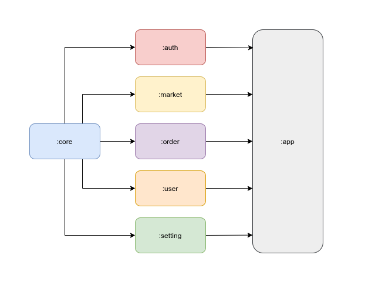

# Simple Flutter Modularization

Modularization in flutter apps represents a software design pattern that separates functionalities into modules. Each flutter application can be modularized by dividing the application module into library modules. As monolith application grows it becomes less and less maintainable and there is the need to split it in separate modules. See the explaination about modularization on this [video](https://www.youtube.com/watch?v=PZBg5DIzNww&ab_channel=AndroidDevelopers)

  

  

# Package
- [Dio](https://pub.dev/packages/dio) for network services.
- [Kiwi](https://pub.dev/packages/kiwi) for dependency injection
- [BLoC](https://pub.dev/packages/flutter_bloc)

# Result

  

